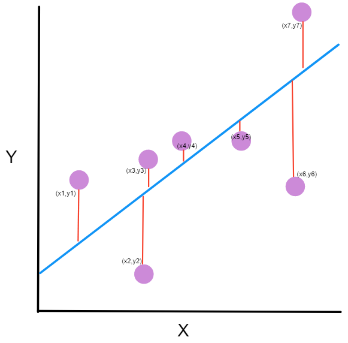
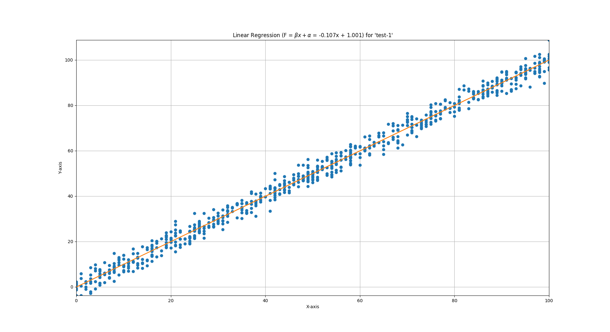
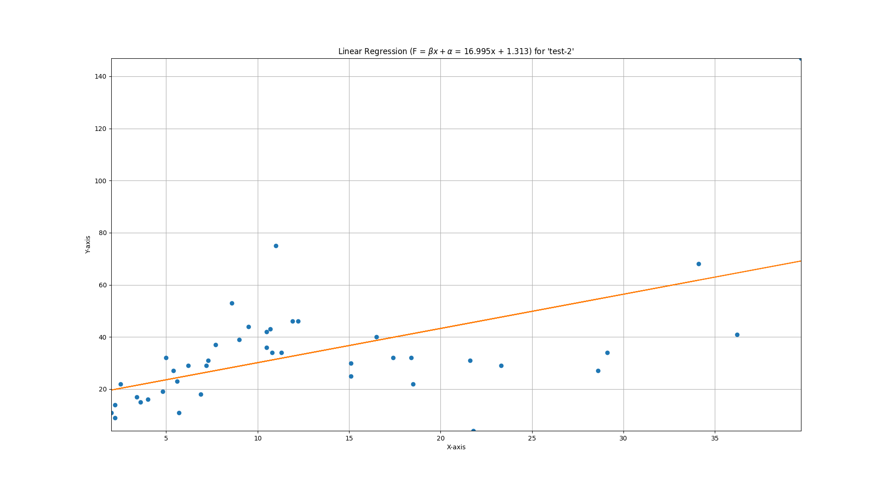

### Linear Regression

_ _ _

##### MÔ TẢ

**Linear Regression** - **Hồi quy tuyến tính** là thuật đoán đơn giản nhất để viết một mô hình dự đoán trả về kết quả số thực như giá nhà cửa, chiều cao, cân nặng, hay giá cổ phiếu giá bitcoin (just for fun), etc.

* Ưu điểm
  
  * Đơn giản
  
  * Dễ hiểu
  
  * Cài đặt nhanh

* Nhược điểm
  
  * Rất nhảy cảm với dữ liệu nhiễu
  
  * Không linh hoạt
  
  * Nên kết quả không đẹp
  
  * Do đó tính ứng dụng thực tế không nhiều

**Bài toán**

Tiếp cận đơn giản và hiểu theo cách của học sinh cấp 3 thì bài toán sẽ như sau:

Có một đống dữ liệu, ở đây là các điểm trên một mặt phẳng. Tìm cách vẽ một đường thẳng đi qua đống dữ liệu đó sao cho đường thẳng tiếp cận gần nhất với các điểm đó.

**Cách giải**

Phương trình đường thẳng sẽ có dạng `F(x) = βx + α`. Ta cần tìm là hai hệ số `β & α`. 

Để đường thẳng tiếp cận gần các điểm dữ liệu nhất thì sai số phải nhỏ nhất, sai số ở đây chính là tổng các delta khoảng cách các điểm đến đường thẳng, tính theo `F(x)` của ta, và khoảng cách thực tế các điểm đó (ta gọi nó là `y`), là nhỏ nhất. Tức là ta có `∑(F𝗑ᵢ - Yᵢ)` nhỏ nhất.

Ở cấp 3 chúng ta đã được học tìm nghiệm cho một bài toán tối ưu ta có thể dùng đạo hàm, nhưng phương trình này bậc nhất, đạo hàm thì biến bị triệt tiêu rồi thì làm sao? Ở đây, ta có cách là bình phương sai số lên, tính chất sai số nó vẫn vậy, và ta sẽ tìm nghiệm ngon lành, các cụ nhà ta gọi cách này là `Squared Error aka SE`. Như vậy, ta sẽ có `J = ∑(F𝗑ᵢ - Yᵢ)²` = `∑((β*xᵢ + α) - yᵢ)²`. Đơn giản hóa ta tạm coi `α = 0` (ko phải bỏ đi, sẽ có ở dưới).

Sau khi đạo hàm ta có `J' = 2(∑βxᵢ² - ∑xᵢyᵢ)` và đây chính là hàm loss của chúng ta.

Giải phương trình này tìm nghiệm `J' = 0 <=> ∑βxᵢ² - ∑xᵢyᵢ = 0`.

Ta sẽ tìm ra `β = ∑xᵢyᵢ ÷ ∑xᵢ²`và `α = Fxᵢ - βxᵢ`

#### CHƯƠNG TRÌNH

> $ pip install --ignore-installed -r requirements.txt
> 
> $ python 01-linear-regression.py

##### KẾT QUẢ

*P.S Không phải dân ML. Là tay mơ về IT, thời gian rảnh tìm hiểu ML cùng anh Tuộc, có gì không đúng ACE cứ thẳng thắng bình luận hướng dẫn chỉ bảo em.*
