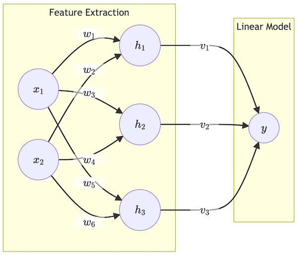
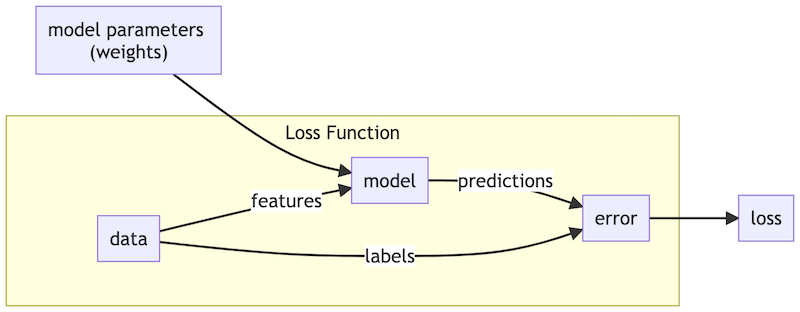

Tuộc Net: a port of
https://github.com/pjreddie/uwnet/tree/main/src

## Convolutional Neural Networks
https://tiendung.github.io/uwnet/notes/04.html
. . .

### Fully Connected Layers and Images
. . .

### Convolutions: Powerful, Local Feature Extraction
. . .

- - -

## Neural Networks
https://tiendung.github.io/uwnet/notes/02.html

### Feature Extraction Built In

Instead of running a linear model directly on our input features we can add an additional step of processing. First our model recombines the input features  into `transformed features`. Then we can run a linear model on these new features. This is the basic idea behind neural networks!

Above is an example, 2 layer neural network.
* The first layer is computed as `h = x * w` (`w`: weights, `h`: hidden layer?)
* The second layer is computed as `y = h * v`.

In small example above we have a model that maps `x -> y` through `hidden layer h` . However, all we are doing is weighted sums, which can be written as matrix multiplication: `h = xw, y=hv`

So our new model is still just a linear model! That’s not good haha. How can we make our new model more powerful so we are actually doing some real feature extraction?

### Activation Functions

At our intermediate or hidden layer we’ll add on an additional function  known as an activation function. This function should be non-linear because we want our feature extraction to be non-linear (otherwise we’ve just constructed one big linear model). The activation function is usually applied element-wise to the vector of weighted sums or neurons. Our new forward propagation will look like: `h = f(x * w), y = h * v`

This new model is definitely non-linear (if we picked a non-linear activation) but how powerful is it?

### The Universal Approximation Theorem

!!! The new neural network is REALLY powerful. All powerful in fact !!!

Ok, not actually ALL powerful but the Universal Approximation Theorem says that given some assumptions and constraints, a neural network with just one hidden layer of sufficient number of neurons can approximate any function inside a bounded domain.

### Training Neural Networks With Backpropagation

The last layer of our network is trained just like linear regression or logistic regression. After calculating the loss we take the derivative with respect to the output. Then we can multiply by the values of  to get the derivative of the loss with respect to the weights `v`.

This is just the same math we used before. Now comes the tricky part. We want to calculate the derivative of the loss with respect to weights `w`, `dL/dw` which we only know how to do if we have `dL/dh`. So first we’ll `backpropagate` the loss from `y` to `h`.

Consider the following: `dL/dh_1 = dL/dy dh/dh_1(h1v1 + h2v2 + h3v3) = dL/dy(v1)`. We are `backpropagating` the `loss` from `y`, through weight `v1`, to `h1`. We can do this using matrix operations as well for all of `h`: `dL/dh = dL/dy v^T`

- - -

## Giải quyết vấn đề bằng ml
https://tiendung.github.io/uwnet/notes/01.html

* Thu thập `data`: rất quan trọng, cần nhiều dữ liệu và nhãn
* Chọn một `model`: chọn cái nào có thể encodes any structure present in your data
* Thiết kế `loss function`: should tell you how bad your model is
* Khởi tạo `parameters`: randomly? zeros? depends on the model
* `optimize`!

Using stochastic `gradient descent`: your goal is to `optimize` your `loss function` to find the `best parameters` for your model. You can think of the `data, model, and labels` as constants and your `loss function` takes as input `model parameters`. `Gradient descent` shows you how to `change your parameters` to `minimize your loss`:

The `loss function` uses model `parameters` to calculate predictions based on `features` from the `data`. It compares these predictions to the `labels` from that data and outputs the calculated `loss`.

## Deep learning

* Neural network based
* Uses large amounts of data
* Incorporates feature extraction as part of the model
	* Has many “layers” of processing
	* Early layers extract simple features from raw data
	* Later layers extract complex features from simple features

This is very exciting for machine learning practitioners. Typically the difference between a good and bad machine learning model comes down to the features the model uses. Good features = good model, or, as they say, “garbage in, garbage out”. Deep learning offers a different path, instead of trying to find what features make a good model, let the model learn and decide for itself.

### Deep learning works well with structure data

So far deep learning has been most successful with data that has some `inherent structure` and the algorithms take advantage of that structure. Images are composed of `pixels and nearby pixels` are statistically more related to each other than far away pixels. Natural language is a string of words where `future words depend on past words`. Sound is a waveform composed of oscillations at different frequencies with those frequencies changing over time. These are the domains where deep learning (currently) works well.

In domains with less structure (for example, diagnosing an illness based on a patient’s symptoms) there are many algorithms that outperform neural networks or deep learning. For those tasks you are much better off using `gradient-boosted decision trees` or `random forests`.

## Learning From Data

The learning part of machine learning means automatically adjusting the parameters of a model based on data. Machine learning algorithms optimize the model parameters to give the best model performance for a data set. To optimize our model we first need a way to measure the performance of a model.

### Loss Functions Describe How Bad a Model Performs

A `loss function` describes the performance of a model and a particular set of `parameters` on a `dataset`. In particular, it measures how badly the model performs, or how far away from correct the model’s predictions are. There are many options for `loss functions` but one common one is `L_2 loss` or `mean squared error` (MSE).

### Optimization as Function Minimization

. . . nhiều công thức toán ...

### Gradient Descent Algorithm

To find `argmin_x(f(x))`:
* start with some estimate of `x`
* repeat until converged: `x = x - learning_rate * gradient(f(x))`

The gradient is sort of like a generalization of the derivative to multiple dimensions. For a function that takes multiple inputs the gradient gives the partial derivatives of that function with respect to each of the inputs. Formally:

`gradient(f(x)) = [d/d(x_1) f(x), d/d(x_2) f(x), ...]`

Like the derivative, the gradient of a function points in the direction of steepest ascent of the function. Therefore if we want to minimize a function we can move in the direction opposite the gradient, hence `gradient descent`!

### Case Study: Linear Regression

For linear regression our model fits a line to a set of data: `m(x)	= a*x + b`. In this case:
* Model `params = {a, b}`
* MSE loss function `L_2(X, m, {a, b}) = 1/n * sum_i=1..n((y_i - (a*x_i + b))^2)`

Let’s define `h_i = a*x_i + b` to be the output of our model. Then we can look just at how we would update the biases of our model: `d/d(b)L_2 = sum(-2*(y_i - h_i))`

Since we are subtracting our gradient this means our update would look like:
`b = b + learning_rate * sum(2*(y_i - h_i))`

- - -

