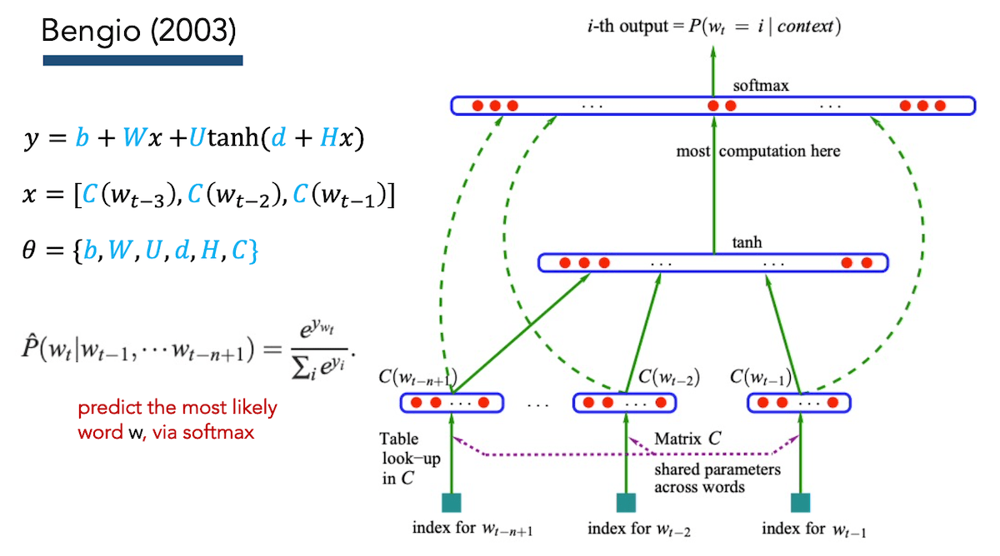

Cách biểu diễn văn bản BOW, TF-IDF ... có nhiều hạn chế như bỏ qua ngữ cảnh (BOW), số chiều không gian quá to (= vocab size), không có sự liên hệ về ngữ nghĩa (TF-IDF)

Mô hình ngôn ngữ n-gram (count-based) tuy đơn giản và hữu dụng nhưng có nhiều hạn chế: OOV (LM nào cũng phải), ngữ cảnh càng lớn (n lớn) thì càng khó handle, ngram count không thể hiện được sự liên hệ về ngữ nghĩa ...

- - -

## Featured Model

Trang 10 của [slides](04_embed.pdf)

IDEA: Thay vì coi từ chỉ là một số báo danh trong từ điền, hãy biểu diễn từ như là nhiều đặc trưng mà: `# of features << # of words in vocab`.

Một mô hình ngôn ngữ dựa trên features:

{width=600 height=331}

{width=600 height=272}

{width=600 height=280}

### How we do train a model to learn these 2 matrices, and the bias vector?

- Use our output probabilities
- Calculate the cross-entropy loss
- Use backprop to calculate gradients
- Update the 2 embedding matrices and bias via Gradient Decent


### Unknown Words

Common ways to amend the data:
• Frequency threshold (e.g., `UNK <= 2`)
• Remove bottom N%
• Represent each word as `sub-words` (e.g., byte-pair encodings)

Common neural modelling approaches:
• Add an `UNK` token to your vocabulary (just like for `n-grams`)


### Evaluation LMs
 
__Very Important:__

• Any given LM must be able to generate the test set (at least).
Otherwise, it cannot be fairly evaluated (OOV problem).

• When comparing multiple LMs to each other, their vocabularies must be the same (e.g., words, sub-words, characters).


### Neural Network Motivation

* __Non-linear power__: using non-linear activation functions can allow us to capture rich, combinatorial attributes of language

* Word embeddings reduce the` # of parameters` and hopefully improve the model's ability to generalize

- - -

### A Neural Probabilistic Language Model. Bengio et al. JMLR (2003)


1/ Thể hiện một từ trong bộ từ vựng tương ứng với một `feature vector` trong `không gian m chiều`

2/ Thể hiện `joint prob function` của chuỗi từ thành của chuỗi vectors

3/ Cùng một lúc học (thay đổi trọng số) `word feature vectors` và các tham số của hàm xác xuất đó


#### Simultaneously learn the representation and do the modelling!

Words that are more semantically similar to one another will have embeddings that are proportionally similar, too.

{width=800 height=445}

- Word embeddings: similar input words get similar vectors
- Similar contexts get similar hidden states
- Similar output words get similar rows in the output matrix 𝑈

Train the model using gradient descent: 
• Use our output probabilities
• Calculate the cross-entropy loss
• Use backprop to calculate gradients
• Update all weight matrices and bias via GD

!! SAME AS WE DO FOR ALL OF OUR NEURAL NETS !!

#### Bengio (2003)

This was not the first neural language model, but it was the first, highly compelling model with great results (e.g., beating n-grams)

The softmax output layer is annoyingly slow

- - -

## Distributional Semantics

_Distributional: meaning is represented by the contexts in which its used_

> “Distributional statements can cover all of the material of a language without requiring support from other types of information” -- Zellig Harris (1954)

> “You shall know a word by the company it keeps” -- John Rupert Firth (1957)

### Auto-regressive language models
```
I bought a _____
Good morning, _____ 
I got my ______
```

### Masked language models
```
I bought a _____ from the bakery
Good morning, _____. Rise and shine! 
I got my ______ license last week
```

### word2vec: skip-gram

Step 1: Iterate through your entire corpus, with sliding context windows of size 𝑵 and step size 𝟏
Step 2: Using the masked center word, try to predict all 2N center words.
Step 3: Calculate your loss and update parameters (like always)

In practice, this softmax is painfully slow. Instead, flip the modelling to be pairs of words:
e.g., (center word, context word)

It would learn to always predict 1. So, probabilistically sample negative examples based on their frequencies. (Negative Sampling)


### word2vec: results

Smaller window sizes yield embeddings such that high similarity scores indicates that the words are interchangeable

Larger window sizes (e.g., 15+) yield embeddings such that high similarity is more indicative of relatedness of the words.

Words that appear in the same contexts are forced to gravitate toward having the same embeddings as one another:

• Imagine two words, w1 and w2, that never appear together, but they each, individually have the exact same contexts with other words. w1 and w2 will have identical embeddings!

• “The” appears the most. What do you imagine its embedding is like?


### word2vec: Remaining Challenges

• Still can’t handle long-range dependencies.
• Each decision is independent of the previous!
• Having a small, fixed window that repeats is a bit forced and awkward