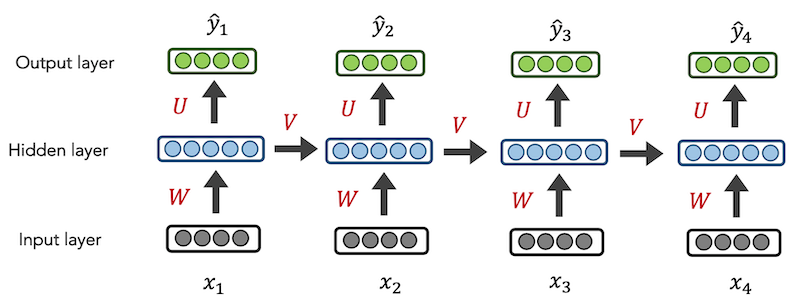

## RNN: Contextualized, Token-based Representations

Trang 30 của [slides](05_rnn.pdf)

### Motivation

Language often has `long-range dependencies`:

- `Emily` earned the top grade on the quiz! Everyone was proud of `her`. 
- `Miquel` earned the top grade on the quiz! Everyone was proud of `him`.

Language is `sequential` in nature:

- characters form words.
- words form sentences.
- sentences form narratives/documents

NLP folks like to operate at the word level, as that's the smallest, convenient unit of meaning.

### Approach

Traditional, pre-deep learning models included HMMs and CRFs.

NN IDEA: for every individual input, output a prediction

RNN IDEA: Let’s use the previous hidden state, too

The recurrent loop `𝑉` conveys that the current hidden layer is influenced by the hidden layer from the previous time step. The initial hidden layer `h_0` can be initialized to `0s`. (Hình trên có `4 hidden layers`: h_1, h_2, h_3, h_4).

**Definition**: a `RNN` is any `neural net` that has a
`non-linear combination` of the `recurrent state` (e.g., hidden layer) `and the input`.
 

 NOTE: The Embedding layer for all of our NN’s current hidden layer never has a non-linear activation. Why?

