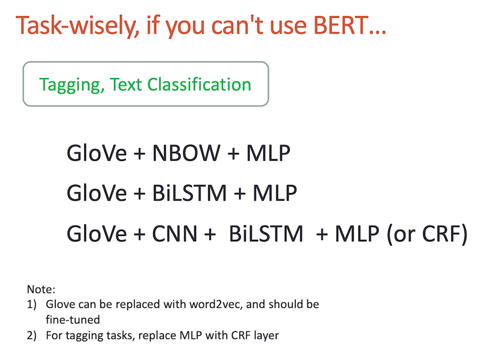

https://github.com/neubig/lowresource-nlp-bootcamp-2020

## Neural Representation Learning
https://www.youtube.com/watch?v=FgYg1ZH5Io8

Nhiều kinh nghiệm ứng dụng thực tiễn

{width=400 height=291}

Note: Ngoài Neurual Representation thì còn nhiều cách Representation khác nữa.

Hiện tại dùng projection layer thay cho embedding layer trong các mô hình nn tinh gọn đang cho kết quả tốt gần tương đương mà lượng tham số giảm đi rất nhiều (xem [pNLP-Mixer](pNLP-mixer.md))
