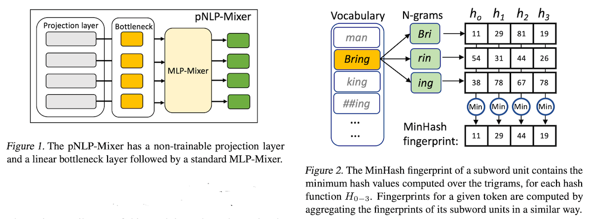

## pNLP-Mixer: an Efficient all-MLP Architecture for Language (09/02/2022)

https://arxiv.org/pdf/2202.04350.pdf

### Tuộc takeaway

Có ba thứ mới mẻ trong bài báo mà Tuộc chưa biết:

1/ thay embedding layer = projection layer

2/ Google mới đẻ ra thuật toán fast word piece tokenization algorithm 

3/ lần đầu tiên MLP-Mixer được áp dụng cho NLP và kết quả tốt!

- - -

### Giới thiệu

Các mô hình ngôn ngữ dựa trên transformer (bert và đồng bọn) nhiều lớp, nhiều tham số đang thống trị NLP. Chúng tốn bộ nhớ và tài nguyên khi đưa vào ứng dụng. Những phát kiến gần đây cho thấy rằng có thể thiết kế những mô hình tinh gọn có độ chính xác cạnh tranh với những mô hình lớn mà chi phí bỏ ra chỉ bằng một phần nhỏ.

Trong computer vision, kiến trúc `MLP-Mixer` đã gần chạm ngưỡng độ chính xác cao nhất với số lượng tham số ít hơn hẳn. Vì thế đây là một kiến trúc hấp dẫn về độ hiệu quả cao khi áp dụng cho xử lý ngôn ngữ ở 3 điểm:

1/ Không như RNN (mạng nơ-ron hồi quy), `MLP-Mixer` có thể chạy song song

2/ Không như Transformer, độ phức tạp của `MLP-Mixer` tăng lên tỉ lệ thuận với chiều dài của chuỗi đầu vào mà vẫn nắm bắt được sự ảnh hưởng tầm xa của dữ liệu (long-range dependencies).

3/ `MLP-Mixer` chỉ bao gồm MLP blocks, nhờ thế có thể tăng tốc trên rất nhiều phần cứng khác nhau (không kén phần cứng)

Tuy lợi ích như thế nhưng chưa có ai áp dụng `MLP-Mixer` để xử lý ngôn ngữ cả, có lẽ do có sự khó khăn việc tạo ra các features phù hợp từ ngữ liệu text. Bài báo thử nghiệm nhiều `embedding-free projection layers` và tìm ra một projection không làm ảnh hưởng tới hiệu quả của mô hình với dữ liệu text. Mô hình đó được gọi là pNLP-Mixer.

Kết quả rất khả quan. pNLP-Mixer gần như đạt được độ chính xác của mBERT (nhiều tham số hơn 38 lần) và vượt trội hơn hẳn so với mô hình tinh gọn pQRNN của Google với số lượng tham số chỉ bằng 1/3. Với tác vụ phân loại chuỗi dài, pNLP-Mixer cho kết quả tốt hơn RoBERTa với số lượng tham số lớn hơn pNLP-Mixer 100 lần! Điều này cho thấy tiềm năng của kiến trúc pNLP-Mixer.

## Mô hình

pNLP-Mixer là kiến trúc dựa trên projection (figure 1), thay vì lưu một ma trận các vector đặc trưng của từng từ trong bộ từ vựng (ma trận này có khích thước bằng số từ trong bộ từ vựng nhân với độ lớn của vector đặc trưng, có thể lên tới vài triệu phần tử), mô hình này sử dụng một projection layer để ánh xạ cấu trúc hình thái học của từng từ trong chuỗi text đầu vào sử dụng hàm hash không cần huấn luyện (figure 2). Projection layer này có thể được coi là bước trích chọn đặc trưng để tạo ra vector đặc trưng cho từng từ.

__Note__: Text Tiếng Việt encoded theo âm vị chứ không phải hình vị học như tiếng Anh. Tách âm tiết tiếng Việt ra thành các sub-unit như thế nào cho hợp lý là bước đầu tiên cần làm! Thử nghiệm các cách projection khác nhau như `MinHash, Binary, SimHash ..` để chọn projection phù hợp!

Sau bước trích chọn đặc trưng bằng projection layer, các vector đặc trưng được đẩy qua một lớp tuyến tính có thể huấn luyện được (trainable linear layer) gọi là `bottleneck layer`. Đầu ra của `bottleneck layer` là đầu vào của một chuỗi các khối MLP như trong kiến trúc tiêu chuẩn của [MLP-Mixer: An all-mlp architecture for vision](https://arxiv.org/pdf/2105.01601.pdf).

Kiến trúc này rất dễ cài đặt, thân thiện với phần cứng từ mobile cho tới server cũng có thể hỗ trợ tăng tốc tính toán. Bài báo chỉ ra rằng:

> Mô hình đơn giản như `MLP-Mixer` có thể thay thế cho các 
> mô hình transformer cồng kềnh trong lĩnh vực xử lý ngôn ngữ tự nhiên.

Để làm được điều đó thì việc xác lập các đặc trưng đầu vào có chất lượng cao là vô cùng quan trọng.

#### `Projection Layer`

Dựa trên locality sensitive hashing (LSH) để tạo nên các đặt trưng của đầu vào text. Sử dụng nhiều hàm hash (h0, h1, h2, ... hn), áp chúng lên mỗi sub-word units của từng từ đầu vào rồi lấy min của chúng làm vector đặc trưng của từ đó (figure 2) gọi là `MinHash Fingerprints`.

#### `Bottleneck Layer`

Theo [1] `fingerprints` này chưa trực tiếp hữu dụng cho NN nên được đẩy tiếp qua `bottleneck layer` để NN có thể học được `representation` của từng từ.

#### Lớp tiếp theo

`bottleneck layer` cũng chưa học được context của từ nên được đẩy tiếp qua một lớp khác, với pQRNN thì là `bidirectional QRNN encoders`, còn với pNLP thì là `MLP-Mixer` tiêu chuẩn.

## Model Investigation

We use as base model a pNLP- Mixer with 2 layers, bottleneck and hidden sizes of 256 and input sequence length of 64. We fix the token feature size to 1024 with window size 1. We train for 80 epochs with learning rate 5e−4 and batch size 256. We use the vocabulary from BERT base multilingual cased and the [fast word piece tokenization algorithm](https://ai.googleblog.com/2021/12/a-fast-wordpiece-tokenization-system.html) from Song et al. (2021).

... (đoạn này chứng tỏ người viết nghiêm túc tới thử nghiệm của mình) ...

## Kết quả

Kết quả thử nghiệm cho thấy:

* pNLP-Mixer Small với 630k tham số 8-bit (độ lớn 630kb) đạt kết bỏ xa 2M float transformer, và tốt hơn pQRNN 2M 8-bit.

* PNLP-Mixer X-LARGE với 4.4M 8-bit đạt kết quả gần như bằng mBERT 170M float (lớn gấp 38 lần).

## Kết luận

* pNLP-Mixer và pQRNN là 2 mô hình nhỏ gọn đạt kết quả cao, điều này là nhờ sử dụng `projection layer` thay vì ma trận nhúng. Đấy là điểm khác biệt cơ bản của các kiến trúc tinh!

* pNLP-Mixer khác với pQRNN ở chỗ nó sử dụng `MLP-Mixer` thay vì `RNN`, điều này giúp cài đặt mô hình đơn giản, tăng tốc độ tính toán, thân thiện với nhiều phần cứng từ mobile cho tới server.

* Kết quả thử nghiệm cho thấy với số lượng tham số chỉ bằng 1/3 mà `pNLP-Mixer` đã cho kết quả tốt hơn `pQRNN`!

=> Đây là mô hình hiệu năng cao, tính ứng dụng cao và thân thiện với phần cứng!

THAM KHẢO

[1] https://ai.googleblog.com/2020/09/advancing-nlp-with-efficient-projection.html

- - -

https://github.com/google-research/vision_transformer#mlp-mixer

MLP-Mixer (Mixer for short) consists of per-patch linear embeddings, Mixer layers, and a classifier head. Mixer layers contain one token-mixing MLP and one channel-mixing MLP, each consisting of two fully-connected layers and a GELU nonlinearity. Other components include: skip-connections, dropout, and linear classifier head.

- - -

https://zhangtemplar.github.io/mlp-mixer

=> Trainning mlp-mixer phải có đủ dữ liệu !!!
 It is also found at similar accuracy, MLP-Mixer and transformer are faster than CNN (ResNet) for inference and training by 2-3 times.

